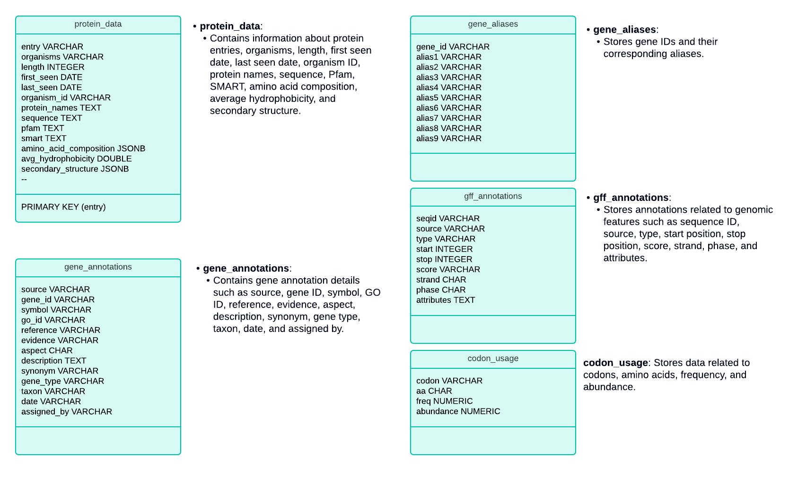

# GenoQuery: Interactive Genomic Data Chatbot

### 🎥 [YouTube PlayList](https://www.youtube.com/playlist?list=PLuJI6RWPU5Viiw0ph9CwXEYWb27ss0tjd) 🎬

## Overview
GenoQuery is an innovative tool designed to streamline the process of querying genomic and biological data through a user-friendly chatbot interface. Developed with the intention of simplifying access to complex datasets, GenoQuery enables researchers, scientists, and academicians to interact with, extract, and analyze data from extensive genomic databases like PlasmoDB with unprecedented ease.

This project builds on top of the chatbot developed as part of the [Protein Data Visualizer](https://github.com/parthasarathydNU/protien-data-visualizer) project.

## Purpose
The primary objective of GenoQuery is to facilitate effortless interaction with genomic data that traditionally requires specialized knowledge to navigate and process. By integrating a natural language processing (NLP) interface, GenoQuery allows users to make inquiries in plain English and receive data in a comprehensible format, thereby significantly enhancing productivity and focus on core research activities.

## Key Features
- **Natural Language Queries**: Users can ask questions in natural language. GenoQuery interprets these inquiries and fetches the required information from the PlasmoDB. We start with Plasmodium falciparum 3D7 and then will be extending this to other organisms.
- **Data Integration**: Seamlessly integrates various data formats from genomic databases, including FASTA, GFF, and XML.
- **Customizable Responses**: Tailors information retrieval to the specificity and depth required by the user, ranging from general data overviews to detailed genetic analyses.
- **User-Centric Design**: Emphasizes an intuitive user interface that requires minimal technical expertise, making it accessible to a broader audience within the biomedical field.

## How It Helps
For researchers and professionals working with genomic data, GenoQuery cuts down the time spent on data retrieval and preliminary analysis. Whether it’s for academic research, pharmaceutical developments, or genetic engineering projects, GenoQuery provides a straightforward pathway to access and interpret complex datasets, which are often challenging to handle due to their size and complexity.

## Getting Started
To start using GenoQuery, users need to set up the backend server which processes the queries and interacts with the genomic databases. Detailed instructions for setting up the server and deploying the chatbot interface are provided in the subsequent sections.

## Documentation
Further documentation detailing the system architecture, API endpoints, and examples of queries can be found in the `docs` folder.

## Contributing
We welcome contributions from the community. If you wish to contribute to the project, please fork the repository and submit a pull request.

## License
GenoQuery is released under the MIT License. See the LICENSE file for more details.

## Contact
For support or collaboration, feel free to reach out to me through [LinkedIn](https://www.linkedin.com/in/parthadhruv/) or drop me an email at [parthasarathy.d@northeastern.edu](mailto:parthasarathy.d@northeastern.edu).
